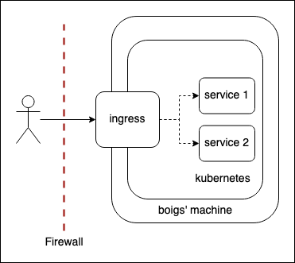

# bifrost

_boigs' API gateway_


## Description

This repository contains all the configuration for the API gateway. Continue reading
for more details.


## Design

The bifrost is made up of one component:
1. K8S ingress, which then routes the traffic to the appropriate service.



Implementation details:
- Ingress controller is [`nginx`](https://kubernetes.github.io/ingress-nginx/deploy/#minikube).
- TLS certificates are managed with [`cert-manager`](https://github.com/cert-manager/cert-manager).


##  Setup

Enable microk8s's ingress and cert-manager addon:

```
microk8s enable ingress
microk8s enable cert-manager
```

Start everything:

```
kubectl apply -f cert-manager.yml
kubectl apply -f ingress.yml
```
